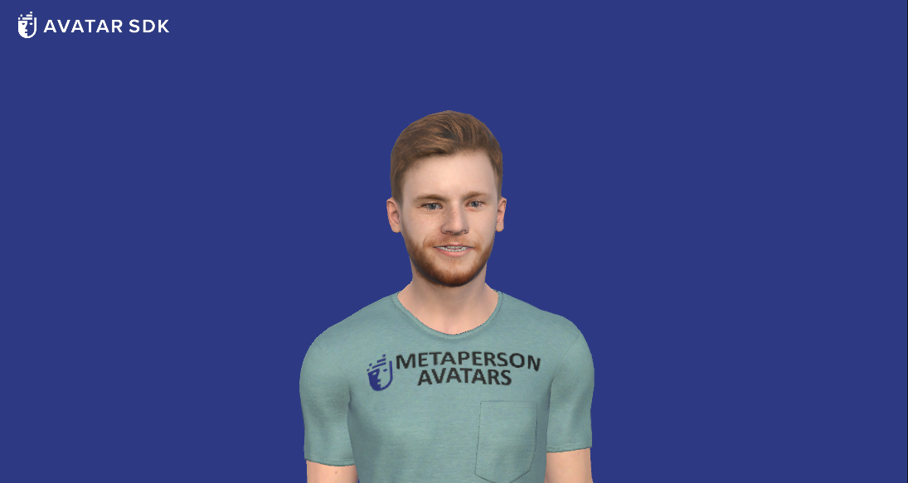
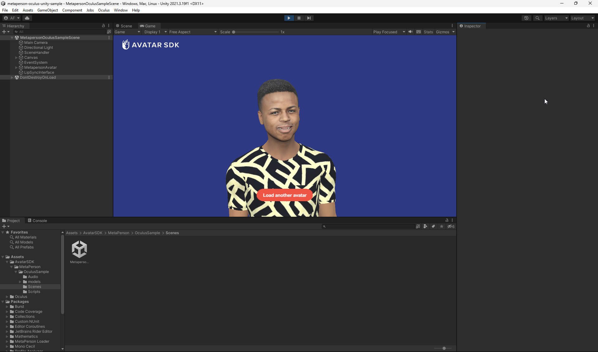
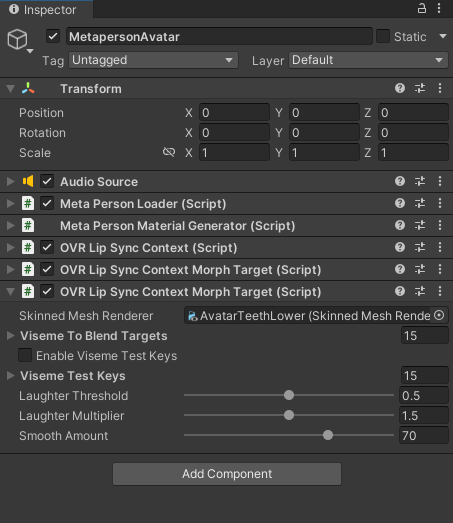
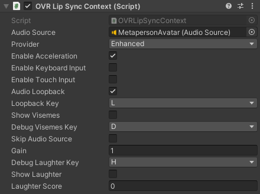
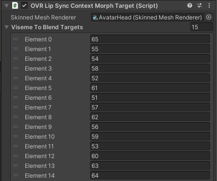

# MetaPerson - Unity Oculus Lipsync sample

This sample demonstrates using [MetaPerson](https://metaperson.avatarsdk.com/) avatars in Unity with the [Oculus Lipsync](https://developers.meta.com/horizon/downloads/package/oculus-lipsync-unity/) plugin.



## Requirements

- Unity 2021.3.19f1 or newer

## Getting Started

1. Install Unity 2021.3.19f1 or newer.
2. Clone this repository to your computer.
3. Open the project in Unity.
4. Open the `\Assets\AvatarSDK\MetaPerson\OculusSample\Scenes\MetapersonOculusSampleScene.unity` scene.
5. Run the project and see how the MetaPerson avatar on the scene is animated with the Oculus Lipsync.



6. Click on the `Load another avatar` button and wait for another MetaPerson avatar to be downloaded, replacing the original one.

## How does it work



A predefined avatar on the scene is animated with Oculus Lipsync when you run the project. When you run the application and click the button, another avatar is downloaded. Then, it replaces the original one. Audio and facial animation keep playing continuously for the new avatar. The MetaPerson Avatar object placed on the scene contains the predefined MetaPerson avatar and has several attached components. `AudioSource` component is responsible for playing an audio clip. `OVRLipSyncContext` serves as an interface to the Oculus Lipsync engine. This component should be added to the scene once for each Audio Source. `OVRLipSyncContextMorphTarget` bridges the output of the viseme (facial expression) detection system to the morph targets of a skinned mesh renderer. It allows you to control the facial expressions of a character model based on the detected visemes. For MetaPerson avatars, we need two `OVRLipSyncContextMorphTarget` components attached: one for avatar head mesh and another one for lower teeth mesh.

## Oculus configuration



To configure the `OVRLipSyncContext` we simply need to provide the reference to Audio Source.



For the first instance of the `OVRLipSyncContextMorphTarget` we will reference the `AvatarHead` skinned mesh renderer. We also need to set the visemes mapping (indices of the skeletal mesh blendshapes corresponding to lipsync visemes). Visemes order is: sil, PP, FF, TH, DD, kk, CH, SS, nn, RR, aa, E, IH, oh, ou. 


A similar configuration should be done for the second instance of the `OVRLipSyncContextMorphTarget`. Here we provide a reference to the `AvatarTeethLower` skinned mesh renderer and set the corresponding visemes mapping.

## Runtime configuration

When we change the avatar in the scene to one loaded from the cloud, we perform a runtime lipsync configuration. See the `OnButtonClick` method of the `OculusSampleSceneHandler` class:

```cs
async void OnButtonClick()
{
    button.gameObject.SetActive(false);
    progressText.gameObject.SetActive(true);

    await loader.LoadModelAsync(avatarUri, ProgressReport);
    progressText.gameObject.SetActive(false);
    
    AvatarSdkOculusTools.Configure(loader.avatarObject, dstObject);
    MetaPersonUtils.ReplaceAvatar(loader.avatarObject, existingAvatar);
}
```

Here we call the `AvatarSdkOculusTools.Configure` method and pass avatar objects to it. This method configures an avatar object for lip syncing. It checks if the object has an `AudioSource` component attached to it. If not, it adds a new `AudioSource` component, sets some properties like loop and `playOnAwake`, and assigns the `audioClip` parameter to the clip property. 

```cs
 var audioComponent = parentObj.GetComponent<AudioSource>();
 if (audioComponent == null)
 {
     audioComponent = parentObj.AddComponent<AudioSource>();
     audioComponent.loop = true;
     audioComponent.playOnAwake = true;
     audioComponent.clip = audioClip;
     parentObj.AddComponent<AudioSource>();
 }
```

Next, it checks if the object has an `OVRLipSyncContext` component attached to it. If not, it adds a new `OVRLipSyncContext` component and sets some properties. 

```cs
var context = parentObj.GetComponent<OVRLipSyncContext>();
if (context == null)
{
    context = parentObj.AddComponent<OVRLipSyncContext>();
    context.audioSource = audioComponent;
    context.enableAcceleration = true;
    context.audioLoopback = true;
    context.gain = 1.0f;
}
```

Then, it retrieves an array of `OVRLipSyncContextMorphTarget` components. If no `OVRLipSyncContextMorphTarget` components are found, two new instances of `OVRLipSyncContextMorphTarget` will be added to the object. It then sets properties like `blendshapeScale` and assigns values to the `visemeToBlendTargets` arrays based on the `headBlendshapes` and `teethBlendshapes` arrays defined earlier in the code. These arrays contain indices of blendshapes for Head and Teeth skeletal meshes. They are the same ones we used for editor-time configuration.

```cs
 if (contextMorphTargets.Count() == 0)
 {
     headMorphTargets = parentObj.AddComponent<OVRLipSyncContextMorphTarget>();
     teethMorphTargets = parentObj.AddComponent<OVRLipSyncContextMorphTarget>();
     headMorphTargets.blendshapeScale = teethMorphTargets.blendshapeScale = GetMaxBlendshapesValue(avatarObj);
     headMorphTargets.skinnedMeshRenderer = headMesh;
     teethMorphTargets.skinnedMeshRenderer = teethLowerMesh;
     
     for(int i = 0; i < teethMorphTargets.visemeToBlendTargets.Count(); i++)
     {
         teethMorphTargets.visemeToBlendTargets[i] = teethBlendshapes[i];
         headMorphTargets.visemeToBlendTargets[i] = headBlendshapes[i];
     }           
 }
```

The important lines here are:

```cs
 headMorphTargets.skinnedMeshRenderer = headMesh;
 teethMorphTargets.skinnedMeshRenderer = teethLowerMesh;
```

We provide references to the corresponding skeletal meshes to our O`VRLipSyncContextMorphTarget` objects. Now we're ready to go.

## License

This OVRLipSync plugin is Oculus' property and is provided under the [Oculus SDK License](https://developer.oculus.com/licenses/audio-3.3/), which allows for personal and commercial use. By using this plugin, you agree to the terms of the Oculus SDK License.

## Support

If you have any questions or issues with the sample, don't hesitate to contact us at <support@avatarsdk.com>.
