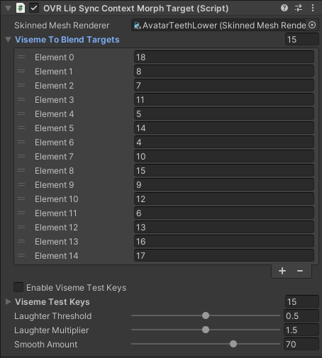

# MetaPerson - Unity Oculus LipSync sample

This sample demonstrates using [MetaPerson](https://metaperson.avatarsdk.com/) avatars in Unity with the [Oculus LipSync](https://developers.meta.com/horizon/downloads/package/oculus-lipsync-unity/) plugin.

## Requirements

- Unity 2021.3.19f1 or newer

## Getting Started

1. Install Unity 2021.3.19f1 or newer.
2. Clone this repository to your computer.
3. Open the project in Unity.
4. Open the `\Assets\AvatarSDK\MetaPerson\OculusSample\Scenes\MetapersonOculusSampleScene.unity` scene.
5. Run the project and see how the MetaPerson avatar on the scene is animated with the Oculus LipSync.

6. Click on the `Load another avatar` button and wait for another MetaPerson avatar to be downloaded replacing the original one

## How does it work

There is a predefined avatar on the scene that is animated with Oculus LipSync when you run the project. When you run the application and click the button, another avatar is downloaded. Then it replaces the original one. Audio and facial animation keep playing continuously for the new avatar. The MetapersonAvatar object placed on the scene contains the predefined MetaPerson avatar and has a number of attached components. `AudioSource` component is responsible for playing audio clip.  `OVRLipSyncContext` serves as an interface to the Oculus Lip-Sync engine. This component should be added into the scene once for each Audio Source. `OVRLipSyncContextMorphTarget` bridges the output of the viseme (facial expression) detection system to the morph targets of a skinned mesh renderer. It allows you to control the facial expressions of a character model based on the detected visemes. For Metaperson avatars we need two `OVRLipSyncContextMorphTarget` components attached: one for avatar head mesh, another one for lower teeth mesh.

## Oculus configuration

To configure the we simply need to provide the reference to Audio Source.

For the first instance of the `OVRLipSyncContextMorphTarget` we will provide a reference to the `AvatarHead` skinned mesh renderer. We also need to set the visemes mapping (indices of the skeletal mesh blendshapes that correspond to LipSync visemes). Visemes order is: sil, PP, FF, TH, DD, kk, CH, SS, nn, RR, aa, E, IH, oh, ou. 

Similar configuration should be done for the second instance of the `OVRLipSyncContextMorphTarget`. Here we provide a reference to the `AvatarTeethLower` skinned mesh renderer and set the corresponding visemes mapping.

## License

This OVRLipSync plugin is the property of Oculus and is provided under the [Oculus SDK License](https://developer.oculus.com/licenses/audio-3.3/), which allows for personal and commercial use. By using this plugin, you agree to the terms of the Oculus SDK License.

## Support

If you have any questions or issues with the sample, please contact us <support@avatarsdk.com>.